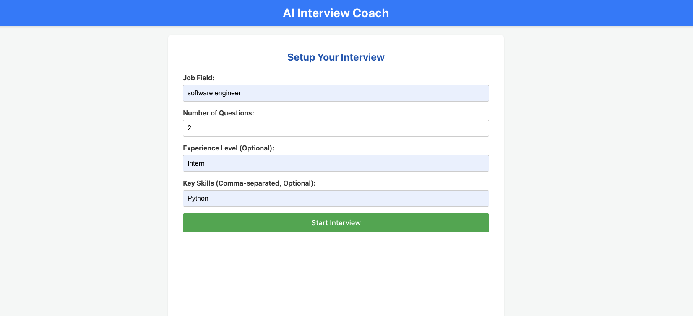
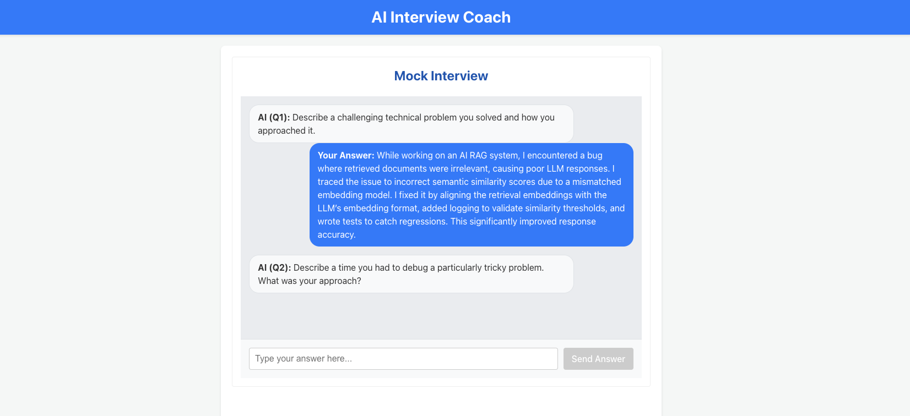
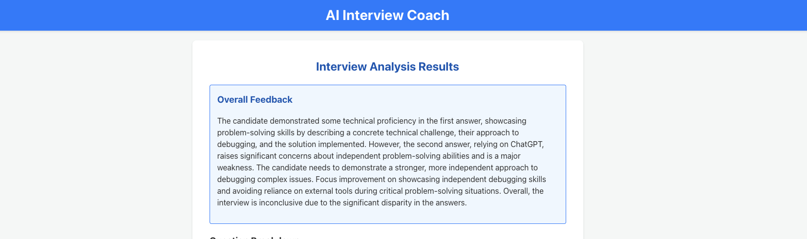
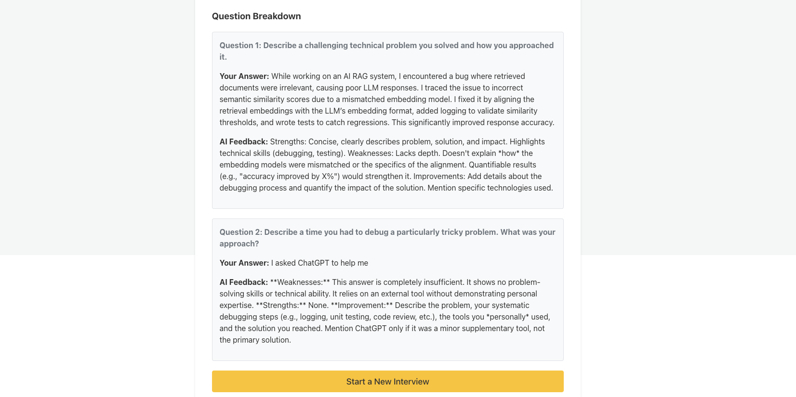

## Project Overview

The application provides an AI-powered mock interview simulation.

1.  **Setup:** Users begin by configuring interview parameters, including the desired job field, the number of questions they want to be asked, their experience level, and specific skills they wish to focus on.
2.  **Interview:** Leveraging the power of Google Gemini, the AI generates relevant questions based on the user's setup and presents them one by one in a chatbot-style interface. The user provides their answers sequentially.
3.  **Analysis:** Upon completing the interview (answering all requested questions), the application transitions to a results page. Here, the AI (powered by Google Gemini) provides a detailed analysis, including overall feedback on the user's performance and specific analysis for each question and the corresponding answer.

## Tech Stack

*   **Frontend:** React, Vite
*   **Backend:** Python, FastAPI
*   **AI/NLP:** Google Gemini (via API)
*   **Data Storage:** In-memory dictionary (for demonstration purposes)
*   **Configuration:** `python-dotenv`, Pydantic

## Project in Action

Here are some screenshots showing the different stages of the AI Interview Coach application:

---

### 1. Interview Setup Page

This is the initial page where users configure their interview settings, specifying details like job field and the number of questions.

---

### 2. Interview Chat Interface

This shows the user interacting with the AI, answering the generated interview questions.

---

### 3. Results Page: Overall Feedback

A view of the summary analysis and general feedback provided by the AI after the interview.

---

### 4. Results Page: Question Breakdown

This section shows the detailed analysis and feedback provided by the AI for each specific question and the user's answer.

---

## Future Work

The following features are planned to enhance the application:

*   Implement persistent data storage (e.g., using SQLAlchemy and a database) instead of the current in-memory storage.
*   Refine and enhance the detailed AI analysis feedback structure and content.
*   Improve the user interface and user experience based on user testing and feedback.
*   Add more robust error handling and input validation on both the frontend and backend.
*   Explore options for different interview types or formats.
